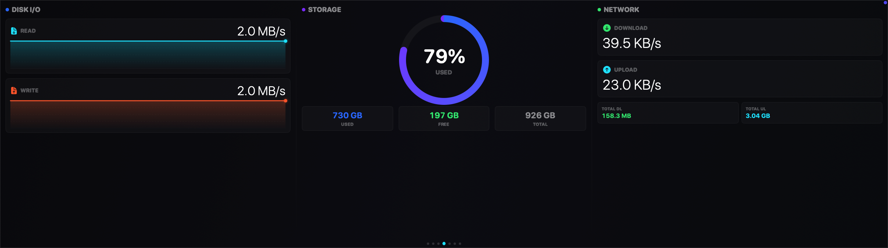

# EdgeControl

[](https://www.apple.com/macos/)
[](https://swift.org)
[](LICENSE)

**A native macOS dashboard for the CORSAIR XENEON EDGE touchscreen display.**

Built from scratch in Swift & SwiftUI — no third-party dependencies. Designed specifically for the 2560×720 form factor with full touch support.


## Why I Built This

I got the XENEON EDGE because I loved the idea of a dedicated touchscreen dashboard on my desk. But on macOS, there's no software for it — it just shows up as another monitor. So I built my own. What you see here is just the beginning — system monitoring and media controls are the foundation, but the plan is much bigger. I'm working on CI/CD monitoring, app-specific widgets, developer tools, and even local AI model interactions to make the dashboard feel more alive and context-aware. This isn't a concept or a demo; it's something I use every single day, and it keeps getting better.

## What It Does

EdgeControl turns your XENEON EDGE into a fully functional system dashboard with 7 swipeable pages:

**System Monitor** — CPU, Memory, Storage & Pressure gauges with live graphs and SMC temperatures

**Now Playing** — Controls media playing in Safari (YouTube, YouTube Music, SoundCloud). Album art, progress bar, play/pause/next/prev — all touch-enabled

**Network & Processes** — Real-time upload/download speeds, top processes by CPU & memory

**Temperatures** — Per-core CPU temps, GPU, SSD, fan speeds with history graphs

**Disk I/O** — Read/write speeds, per-disk breakdown

**Connectivity** — Wi-Fi signal & details, Bluetooth devices, system volume control

**World Clocks** — Multiple timezones, day progress, moon phase

## Screenshots

| Network & Processes | Temperatures | Disk I/O |
|:-:|:-:|:-:|
|  |  |  |

| Media Control | Connectivity | World Clocks |
|:-:|:-:|:-:|
|  |  |  |

## Install

Download the latest `.dmg` from [**Releases**](https://github.com/pakslab/EdgeControl/releases), open it, and drag EdgeControl to Applications.

> Requires macOS 14.0 or later. Works on any display but optimized for the XENEON EDGE (2560×720).

## Build from Source

```bash
git clone https://github.com/kemalandic/edgecontrol.git
cd edgecontrol
xcodegen generate      # requires: brew install xcodegen
open EdgeControl.xcodeproj
# Cmd+R to run
```

## Touch Support

EdgeControl has native HID touch input support for the XENEON EDGE touchscreen. Every button and control works with both mouse clicks and direct touch taps. The touch system auto-calibrates to your display positioning.

## Permissions

- **Location** — weather data (Open-Meteo, free API)
- **Bluetooth** — connected device list

## License

[MIT](LICENSE)

---

Built by [PaksLab](https://pakslab.ai)
