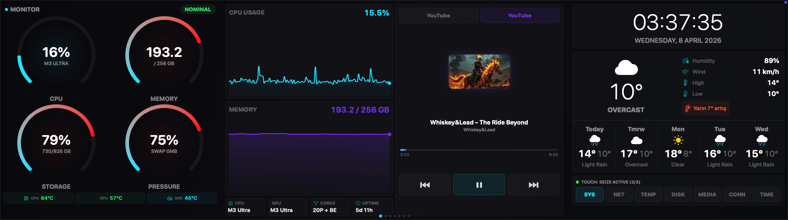
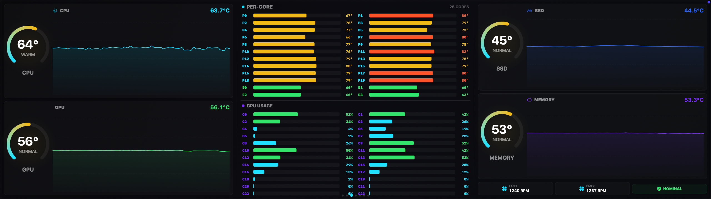
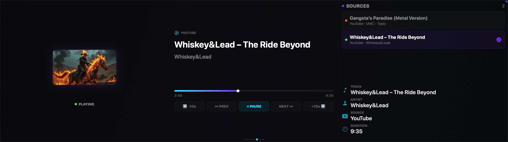
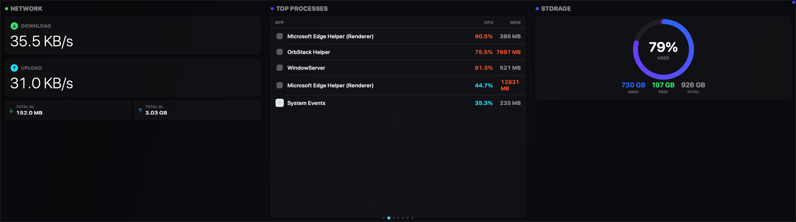
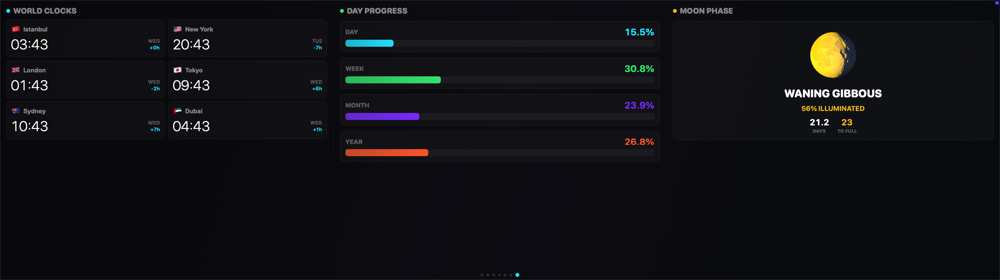
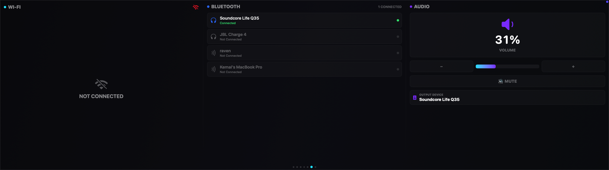

# EdgeControl

[](https://www.apple.com/macos/)
[](https://swift.org)
[](LICENSE)

**A native macOS system dashboard that turns any display into a fully customizable monitoring station.**

Built from scratch in Swift & SwiftUI — no third-party dependencies. Works on any screen: ultrawide monitors, iPads via Sidecar, vertical displays, TVs, or the CORSAIR XENEON EDGE. Includes macOS desktop widgets and full touch support.



## Why I Built This

I got the XENEON EDGE because I loved the idea of a dedicated touchscreen dashboard on my desk. But on macOS, there's no software for it — it just shows up as another monitor. So I built my own.

What started as a basic system monitor for one specific display has grown into a universal dashboard platform that adapts to any screen. 25 widgets, dynamic grid layout, macOS desktop widgets, complete theme customization, and a plugin system. It's something I use every single day, and it keeps getting better.

## What It Does

EdgeControl turns any display into a fully customizable system dashboard. You create pages, place widgets wherever you want on a dynamic grid that automatically adapts to your screen, resize them, and configure everything from colors to fonts. Run it full-screen on a secondary display or as a resizable window on your main monitor.

### 25 Built-in Widgets

**System (9)** — CPU Gauge, Memory Gauge, CPU History, Memory History, Process List, Disk I/O, Storage Bars, Memory Pressure, CPU Cores (per-core usage)

**Temperature (5)** — CPU Temp, GPU Temp, SSD Temp, Temperature History, Per-Core Temp (P-core/E-core breakdown)

**Network (3)** — Network Stats (up/down speeds), WiFi Info (SSID, signal, channel), Bluetooth Devices

**Media (2)** — Now Playing (Safari, Chrome, Edge, Spotify, Apple Music — controls, artwork, progress), Audio Devices (output, volume)

**Info (5)** — Weather (current + 5-day forecast), Clock (10 visual themes), World Clocks, Day Progress, Moon Phase

**DevTools (1)** — CI/CD Runs (GitHub Actions across all repos)

### Dynamic Grid Layout

- Grid adapts to any screen: 6x4 to 24x12 cells, ~120px per cell
- Works on any display — XENEON EDGE (20x6), 1080p monitor (16x9), iPad Sidecar (10x7), vertical screens, TVs
- Kiosk mode (full-screen borderless) or window mode (resizable)
- Drag to move, corner handles to resize, collision detection
- Unlimited pages with swipe navigation
- Each widget adapts its layout to its size (compact, bar, chart, full)

### Full Theme Customization

- **8 presets**: Default Dark, OLED Black, Midnight Blue, Neon Cyan, Neon Purple, Arctic, Ember, Terminal
- **Custom color scheme**: individually set all 8 scheme colors (backgrounds, text, borders)
- **Accent color**: 9 presets + native color picker for any color
- **Per-widget colors**: primary/secondary/tertiary color overrides with native color picker
- **Font system**: 4 font families, global scale, 6 individually adjustable font levels
- **Widget appearance**: opacity, corner radius, gap

### Clock Widget — 10 Themes

Digital, Analog, LCD Retro, Minimal, Split, Rings, Day Bar, Neon, Binary, Dot Matrix

### macOS Desktop Widgets

EdgeControl provides native macOS desktop widgets via WidgetKit — add system metrics directly to your desktop without opening the app.

- **System Monitor** — CPU and memory gauges (small/medium)
- **Temperature** — CPU, GPU, SSD temps with color coding (small/medium)
- **Disk I/O** — Read/write speeds (small/medium)
- **Network** — Upload/download speeds (small/medium)
- **WiFi Info** — SSID, signal strength, channel (small/medium)
- **CI/CD** — GitHub Actions run status (small/medium/large)
- **Plugin Widget** — Any plugin with `desktopWidget` support rendered as a desktop widget

### Plugin System

Extend EdgeControl with custom HTML/JS widgets:

- `.ecplugin` bundle format with manifest.json
- WKWebView rendering with full JavaScript SDK
- 14 permissions: 9 data (system metrics, temperature, network, etc.) + 5 actions (notifications, clipboard, storage, URL, network access)
- Dynamic theme integration — CSS custom properties (`--ec-*`) auto-injected and live-updated
- Persistent key-value storage per plugin
- Network sandbox with domain whitelisting
- Lifecycle events: resize, theme change, visibility
- Install from zip, enable/disable, hot reload
- [Plugin Developer Documentation](docs/plugins/getting-started.md)

## Screenshots

| System Monitor | Temperatures | Media Control |
|:-:|:-:|:-:|
|  |  |  |

| Network | Clocks | Connectivity |
|:-:|:-:|:-:|
|  |  |  |

## Install

Download the latest `.dmg` from [**Releases**](https://github.com/kemalandic/edgecontrol/releases), open it, and drag EdgeControl to Applications.

> Requires macOS 14.0 or later. Works on any display — the grid adapts automatically to your screen resolution.

## Build from Source

```bash
git clone https://github.com/kemalandic/edgecontrol.git
cd edgecontrol
xcodegen generate      # requires: brew install xcodegen
open EdgeControl.xcodeproj
# Cmd+R to run
```

## Touch Support

EdgeControl has native HID touch input support for touchscreen displays (including the CORSAIR XENEON EDGE). Every button and control works with both mouse clicks and direct touch taps. The touch system auto-calibrates to your display positioning. On non-touch displays, all controls work with standard mouse input.

## Architecture

```
Sources/EdgeControl/
├── App/            # Entry point, window placement
├── Models/         # WidgetProtocol, DynamicGrid, LayoutConfig, ThemeSettings, PluginManifest, WidgetData
├── Services/       # AppModel, LayoutEngine, WidgetRegistry, PluginManager, WidgetDataBridge, PluginWidgetRenderer
├── UI/
│   ├── Components/ # RadialGauge, HistoryGraph, ThemeEnvironment, WidgetHeader
│   ├── Settings/   # 6-tab settings window (Pages, Widgets, Theme, Plugins, Display, General)
│   ├── DashboardShell.swift  # Main dashboard container with dynamic grid
│   └── GridPageView.swift    # Widget grid renderer with edit mode
└── Widgets/
    ├── System/       # CPU, Memory, Storage, Pressure, Cores, DiskIO, ProcessList
    ├── Temperature/  # CPU/GPU/SSD Temp, TempHistory, PerCoreTemp
    ├── Network/      # NetworkStats, WiFiInfo, Bluetooth
    ├── Media/        # NowPlaying, AudioDevices
    ├── Info/         # Weather, Clock, WorldClocks, DayProgress, MoonPhase
    ├── DevTools/     # CICDRuns
    └── Plugin/       # PluginWebWidget (WKWebView renderer + JS SDK)

Sources/EdgeControlWidgets/   # macOS Desktop Widget Extension (WidgetKit)
├── Providers/     # TimelineProviders for each widget type
└── Views/         # SwiftUI widget views + shared styles
```

## Permissions

- **Location** — weather data (Open-Meteo, free API)
- **Bluetooth** — connected device list

## License

[MIT](LICENSE)

---

Built by [PaksLab](https://pakslab.ai)
